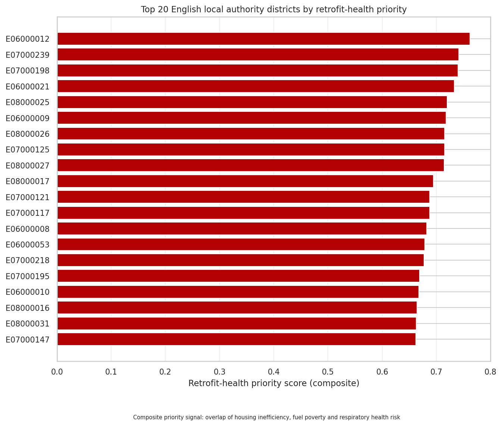
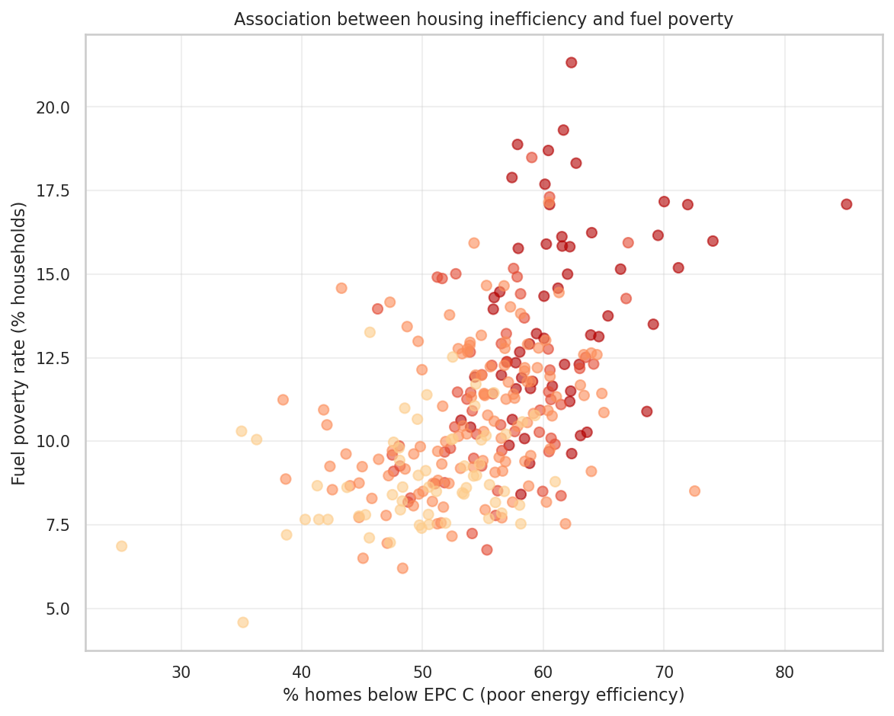
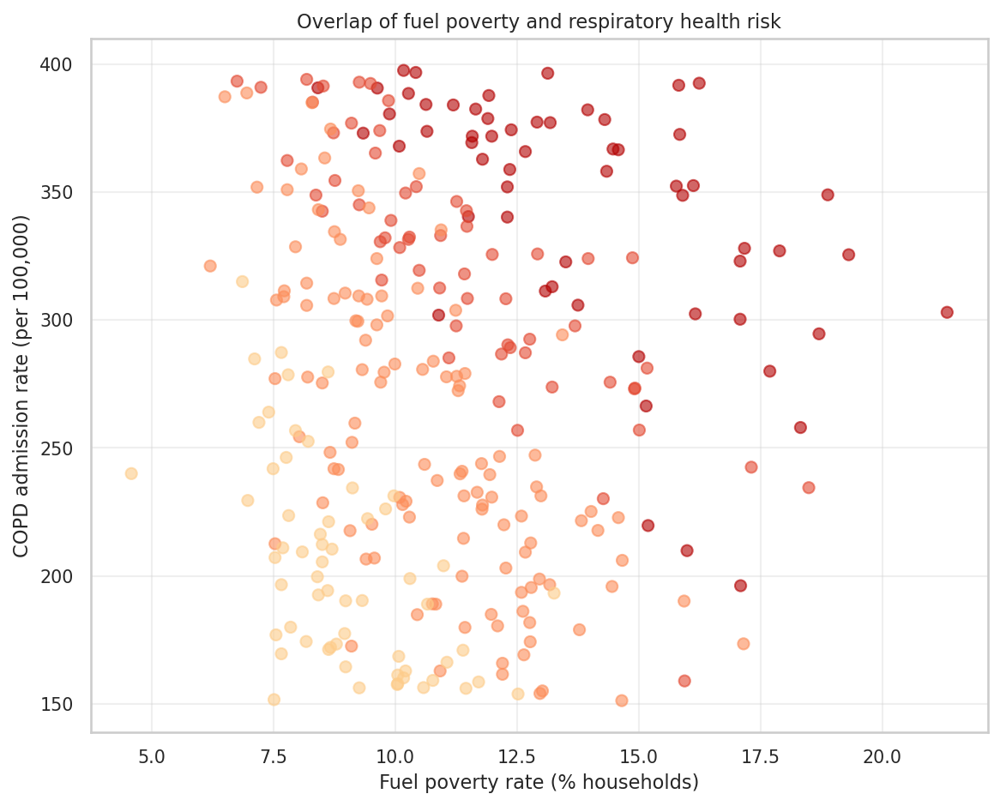
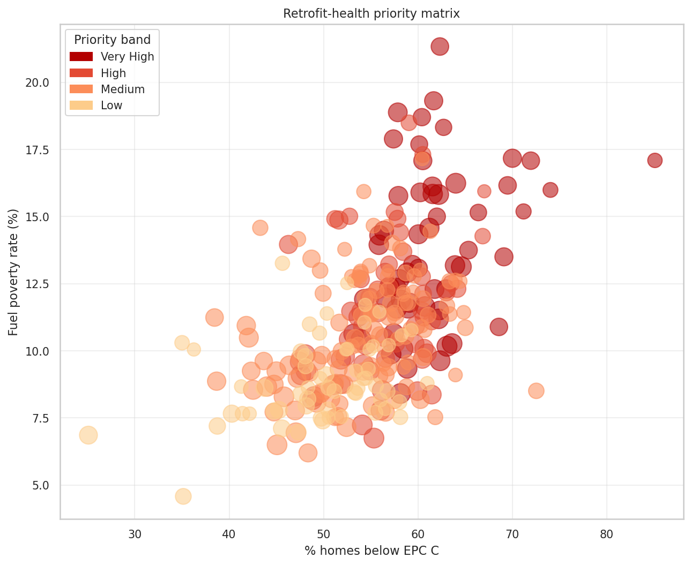
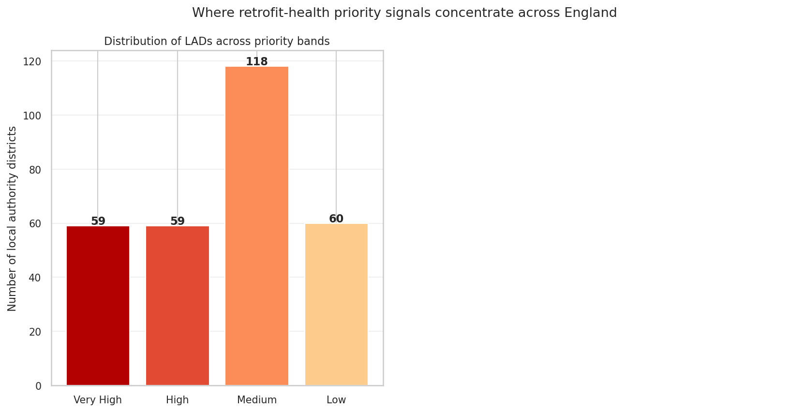

# Health-Focused Retrofit Prioritisation in England

**Linking housing energy efficiency, fuel poverty and respiratory health outcomes**

This project explores where housing retrofit investment may deliver both sustainability and
public health benefits by identifying local authorities where poor housing energy efficiency,
fuel poverty and respiratory health risks overlap.

## Project question

Which local authorities in England should be prioritised for retrofit investment because they
combine poor housing energy efficiency, fuel poverty and worse respiratory health outcomes?

## Why this matters

Buildings are not only an environmental issue — they are also a public health issue. Poorly
insulated homes can contribute to cold, damp and unaffordable living conditions, while retrofit
can support both net zero goals and health equity.

This project connects construction sustainability to public health by identifying local authorities
where housing energy inefficiency, fuel poverty and respiratory health risk overlap — areas where
retrofit investment could deliver both environmental and health benefits.

## Data sources

| Dataset | Source | What it provides |
|---------|--------|-----------------|
| EPC Open Data | MHCLG / EPC Register | Housing energy efficiency by property |
| Sub-regional Fuel Poverty Statistics | DESNZ (2025 release) | Fuel poverty rate by local authority (LILEE metric) |
| OHID Fingertips Respiratory Profile | UKHSA / OHID | COPD admissions, asthma admissions, respiratory mortality |

## Method

1. Aggregate housing energy efficiency indicators by local authority from EPC open data
2. Join sub-regional fuel poverty statistics (LILEE metric, 2023)
3. Join respiratory health indicators from OHID Fingertips
4. Calculate a composite retrofit-health priority score
5. Rank local authorities by combined sustainability and public health need

## Priority score

The composite retrofit-health priority score is calculated as:

```
retrofit_health_priority_score = 0.4 × normalised_percent_homes_below_epc_c
                               + 0.3 × normalised_fuel_poverty_rate
                               + 0.3 × normalised_respiratory_health_risk
```

This does not claim that poor housing energy efficiency directly causes respiratory outcomes.
Instead, it identifies local authorities where housing sustainability, fuel poverty and respiratory
health risks overlap as a priority signal for further investigation.

## Final dataset

The final dataset contains 294 English local authority districts, using LAD-level geography only:

- **E06** — Unitary authorities
- **E07** — Non-metropolitan districts
- **E08** — Metropolitan districts
- **E09** — London boroughs

The analysis excludes non-comparable geography levels such as counties and metropolitan counties.

## Priority band distribution

| Priority band | Number of local authorities |
|---|---:|
| Very High | 59 |
| High | 59 |
| Medium | 117 |
| Low | 59 |
| **Total** | **294** |

## Top priority signals

The highest-scoring local authorities in the final LAD-only dataset include:

1. Stockton-on-Tees
2. Wyre Forest
3. Staffordshire Moorlands
4. Stoke-on-Trent
5. Birmingham
6. Blackpool
7. Coventry
8. Rossendale
9. Dudley
10. Doncaster

These are not claims of direct causation. They indicate areas where housing inefficiency,
fuel poverty and respiratory health risk overlap most strongly and warrant further investigation.

## Visual outputs

### Top 20 priority local authorities



### Housing inefficiency and fuel poverty



### Fuel poverty and respiratory health risk



### Retrofit-health priority matrix



### Priority band distribution



## Repository structure

```
health-focused-retrofit-prioritisation/
├── README.md
├── requirements.txt
├── data/
│   ├── raw/           Source data files
│   ├── processed/     Cleaned intermediate files
│   └── output/        Final LAD-only dataset (CSV)
├── notebooks/         Jupyter notebook with full analysis
├── visuals/           All 5 output charts (PNG)
└── src/               Data processing scripts
```

## Language note

This analysis identifies areas where housing inefficiency, fuel poverty and respiratory health risk
overlap as an association and priority signal. It does not make claims of direct causation.
All findings should be treated as areas for further investigation.
